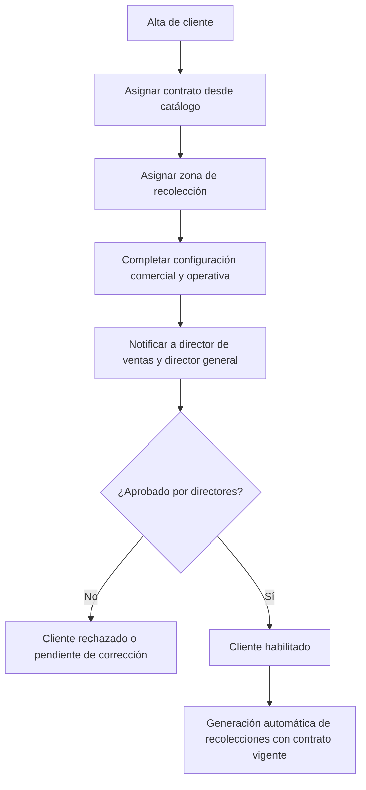
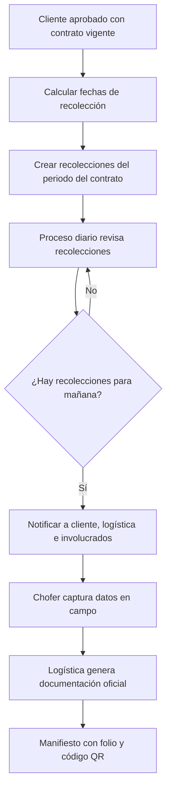
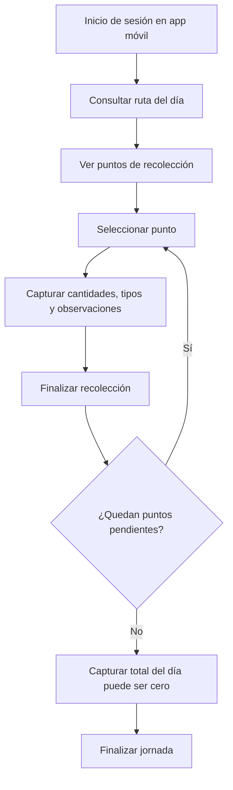
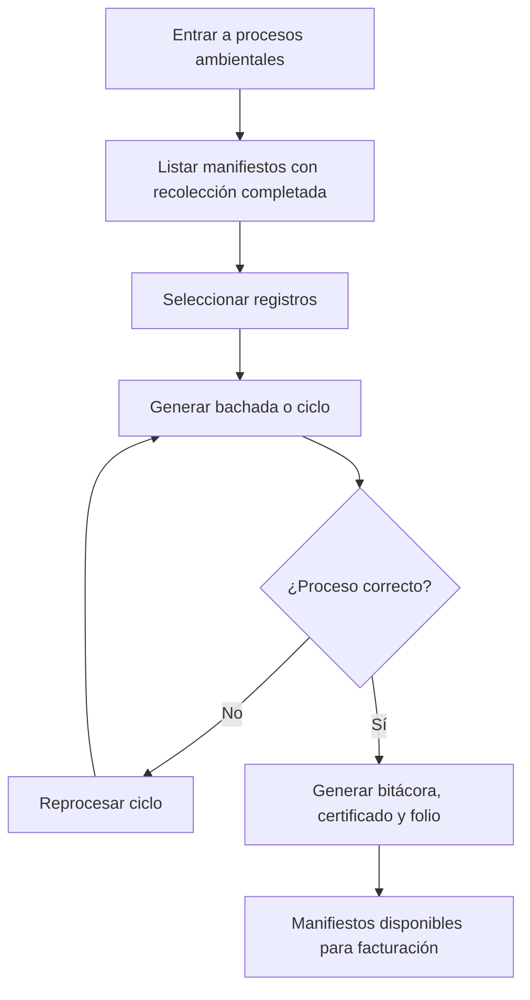
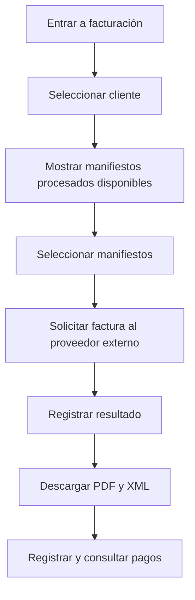
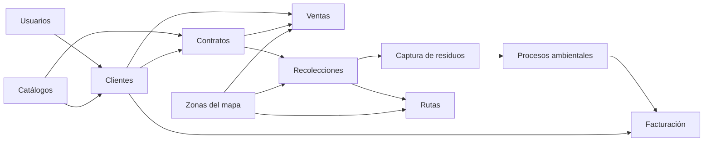

# Módulos y alcance del sistema RPBI

Documento de alcance funcional de **BAN RPBI**, plataforma integral para la gestión de residuos peligrosos biológico-infecciosos (RPBI).

| Concepto | Descripción |
| -------- | ----------- |
| Audiencia | Producto, desarrollo y agentes de Cursor |
| Idioma | Español |
| Estado del documento | Alcance funcional de referencia; sujeto a validación |
| Relacionado | [Índice de documentación](README.md) |

> **Cómo leer este documento**
>
> - **Alcance confirmado**: objetivo general, roles, flujos y módulos descritos aquí.
> - **Alcance propuesto**: estados, campos y reglas marcados explícitamente como propuestos o pendientes.
> - **Implementación**: la sección [Estado de implementación](#10-estado-de-implementación) refleja evidencia en código; no asume funcionalidad terminada.

---

## 1. Objetivo del sistema

El sistema RPBI debe administrar el ciclo completo de operación, desde la captura de clientes y contratos hasta la facturación y la entrega de documentación.

### Alcance general

- Alta y administración de clientes.
- Gestión y aprobación de contratos.
- Asignación de zonas de recolección.
- Programación automática de recolecciones.
- Planeación y visualización de rutas.
- Captura de información en campo desde dispositivos móviles.
- Gestión del ciclo de procesamiento ambiental.
- Generación de manifiestos.
- Generación de bitácoras y certificados de proceso.
- Integración con un proveedor externo de facturación.
- Generación y descarga de facturas en PDF y XML.
- Consulta y descarga de documentos por parte de los clientes.

El sistema debe automatizar la generación de recolecciones a partir de contratos vigentes, facilitar la captura de datos en campo y generar la documentación legal y operativa requerida.

---

## 2. Roles involucrados

| Rol | Responsabilidades principales |
| --- | ----------------------------- |
| Ventas | Alta de clientes, configuración comercial, creación o asignación de contratos y asignación de zonas |
| Logística | Programación de recolecciones, generación de manifiestos, asignación y visualización de rutas |
| Chofer | Consulta de rutas asignadas y captura de información de recolección desde la aplicación móvil |
| Director de ventas | Revisión y aprobación o rechazo de clientes y contratos |
| Director general | Revisión y aprobación o rechazo de clientes y contratos |
| Administración / Facturación | Selección de manifiestos procesados, generación de facturas y registro de pagos |
| Cliente | Consulta y descarga de contratos, manifiestos, certificados, facturas y otros documentos disponibles |

Los permisos definitivos se administrarán mediante el módulo de usuarios, roles y permisos. Las responsabilidades de esta tabla orientan el diseño de perfiles; no sustituyen las constantes de permiso del sistema.

---

## 3. Flujos principales

### 3.1 Flujo de clientes

1. Un usuario de ventas captura los datos básicos del cliente.
2. Se asigna un contrato desde un catálogo predefinido.
3. La duración estándar inicial del contrato es de un año.
4. Se asigna una zona de recolección desde el catálogo de zonas.
5. Se completa la configuración comercial y operativa del cliente.
6. El sistema envía automáticamente una notificación al director de ventas y al director general.
7. Los directores pueden aprobar o rechazar el alta.
8. Después de recibir las aprobaciones requeridas, el cliente queda habilitado.
9. Un cliente habilitado y con contrato vigente puede generar recolecciones automáticas.



### 3.2 Flujo de recolección

1. Al aprobar un cliente con contrato vigente, el sistema calcula las fechas de recolección correspondientes.
2. Se crean automáticamente los registros de recolección para el periodo completo del contrato.
3. Un proceso automático diario revisa las recolecciones programadas.
4. Cuando existen recolecciones para el día siguiente, se envían correos a:
   - Cliente.
   - Logística.
   - Otros involucrados configurados.
5. El chofer captura en campo la información real de cada recolección.
6. La captura puede incluir cantidades, tipos de residuos, observaciones y fotografías, cuando aplique.
7. Logística genera la documentación oficial.
8. El manifiesto debe contar con folio y código QR.



### 3.3 Flujo del chofer

1. El chofer inicia sesión en la aplicación móvil.
2. Consulta la ruta asignada para el día.
3. Visualiza todos los puntos de recolección.
4. Selecciona el siguiente punto.
5. Captura cantidades, tipos de residuos y observaciones.
6. Finaliza la recolección actual.
7. Si todavía existen puntos pendientes, selecciona el siguiente.
8. Si ya fue la última recolección del día, captura la cantidad total recolectada.
9. La cantidad total puede ser cero.
10. Finaliza la jornada.

**Consideraciones funcionales**

- La interfaz debe estar optimizada para dispositivos móviles.
- Se contempla funcionamiento sin conexión y sincronización posterior.
- La implementación exacta del modo offline deberá validarse técnicamente.
- No se afirma que el modo offline esté implementado.



### 3.4 Flujo de procesos ambientales

1. El usuario entra al módulo de procesos ambientales.
2. El sistema muestra únicamente manifiestos o detalles con recolección completada.
3. El usuario selecciona los registros que desea procesar.
4. Se genera una **bachada** o ciclo de procesamiento.
5. Si el proceso no termina correctamente, se puede repetir el ciclo.
6. Cuando finaliza correctamente, el sistema genera bitácora, certificado de proceso y folio correspondiente.
7. Los manifiestos cambian a un estado que permite continuar con facturación.

> **Bachada:** agrupación de residuos o manifiestos procesados dentro de un mismo ciclo operativo.



### 3.5 Flujo de facturación

1. El usuario de facturación entra al módulo.
2. Selecciona un cliente.
3. El sistema muestra solamente los manifiestos con proceso finalizado y disponibles para facturar.
4. El usuario selecciona los manifiestos.
5. El sistema solicita la generación de la factura al proveedor externo.
6. Se registra el resultado de la operación.
7. El usuario puede descargar PDF y XML.
8. Posteriormente se pueden registrar y consultar pagos.

**Aclaraciones**

- La facturación depende de una integración externa.
- El proveedor definitivo, sus credenciales y sus reglas técnicas deben documentarse por separado.
- Solo pueden facturarse manifiestos con procesamiento completado.



---

## 4. Módulos propuestos

| Módulo | Qué hace | Entradas | Salidas | Dependencias | Notas de alcance |
| ------ | -------- | -------- | ------- | ------------ | ---------------- |
| Clientes | Registrar y administrar clientes con datos básicos, fiscales, de contacto y direcciones. Gestiona estados funcionales propuestos (pendiente de configuración, pendiente de aprobación, activo, inactivo, rechazado), sujetos a validación. | Razón social o nombre, RFC, datos de contacto, direcciones, datos comerciales requeridos | Cliente registrado, cliente configurado, solicitud de aprobación, notificaciones de aprobación o rechazo | Usuarios, roles y permisos, catálogos y configuración, contratos, zonas del mapa | Incluye validación de datos y flujo de aprobación por directores. La información definitiva dependerá del diseño de base de datos y reglas fiscales. |
| Contratos | Crear o asignar contratos a clientes desde un catálogo predefinido. Controla fechas, vigencia, estado, renovación y documento o firma asociada. Duración estándar inicial de un año, configurable. | Cliente, tipo de contrato, fechas de vigencia, frecuencia de recolección, condiciones comerciales, documento firmado cuando aplique | Contrato registrado, folio, estado de vigencia, documento PDF, configuración para generar recolecciones | Clientes, catálogos, usuarios, recolecciones | La aprobación de un contrato vigente puede activar la generación automática de recolecciones. Debe contemplarse renovación. Folios y firma por validar. |
| Ventas | Interfaz unificada para el proceso comercial: alta, configuración inicial, asignación de contratos y zonas, envío a aprobación y seguimiento. | Datos del cliente, contrato seleccionado, zona seleccionada, datos de contacto, información comercial | Cliente configurado, solicitud de aprobación, cliente habilitado o rechazado | Clientes, contratos, zonas, usuarios, aprobaciones | Área de trabajo de ventas. No debe duplicar la lógica interna de Clientes o Contratos; coordina mediante acciones de aplicación. |
| Recolecciones | Calcula y genera automáticamente registros a partir de contratos vigentes. Administra estados funcionales propuestos (programada, en proceso, completada, cancelada, reprogramada), sujetos a validación. | Contrato vigente, zona, frecuencia, datos del cliente, dirección de recolección, tipos de residuos esperados | Recolecciones programadas, notificaciones, recolecciones completadas, información para manifiestos | Clientes, contratos, zonas, captura de residuos, usuarios y choferes, notificaciones | Generación automática masiva, validación diaria, prevención de duplicados, reprogramaciones y cancelaciones. |
| Captura de residuos | Permite al chofer registrar en tiempo real la información recolectada desde un dispositivo móvil. | Punto de recolección, cantidades, tipos de residuos, observaciones, fotografías cuando aplique, evidencias adicionales | Datos registrados, estado de recolección actualizado, evidencia asociada, total de jornada | Recolecciones, rutas, choferes, catálogo de residuos | Interfaz móvil. Se contempla modo offline con sincronización posterior. Deben definirse reglas de conflicto. Evidencias dependen del almacenamiento configurado. |
| Rutas | Visualiza rutas asignadas por chofer y día: puntos, orden, direcciones, datos básicos del cliente y estado de cada punto. | Zonas, direcciones, recolecciones programadas, chofer, fecha | Ruta diaria, lista ordenada de puntos, visualización en mapa, avance de la jornada | Zonas del mapa, recolecciones, clientes, choferes, proveedor de mapas cuando aplique | Se generan a partir de zonas, direcciones y recolecciones. La optimización avanzada es capacidad separada sujeta a validación. No se afirma un proveedor de mapas específico. |
| Zonas del mapa | Catálogo de zonas geográficas de recolección: crear, editar, activar o desactivar, asignar clientes, agrupar recolecciones y apoyar rutas. | Nombre, descripción, área geográfica, límites o coordenadas cuando aplique | Zona registrada, zona en catálogos, clientes asociados, recolecciones agrupadas | Catálogos y configuración, clientes, rutas | Debe integrarse con la estructura de zonas en base de datos. Geolocalización exacta por validar. No se asumen polígonos geográficos sin confirmación. |
| Procesos ambientales | Seleccionar manifiestos o detalles con recolección completada y agruparlos en una bachada o ciclo. Genera bachada, bitácora, certificado, folio y estado final. | Manifiestos, detalles recolectados, cantidades, tipo de proceso, fecha, responsable, resultado | Bachada registrada, bitácora, certificado de proceso, folio, manifiestos disponibles para facturación | Recolecciones, captura de residuos, catálogos, usuarios | Debe permitir reprocesar, conservar trazabilidad y usar folios controlados. |
| Facturación | Seleccionar manifiestos con proceso finalizado y generar facturas por cliente mediante proveedor externo. | Cliente, manifiestos procesados, datos fiscales, conceptos, importes, configuración del proveedor | Factura generada, PDF, XML, folio fiscal o identificador equivalente, estado de facturación, información de pago | Clientes, procesos ambientales, integración de facturación, catálogos fiscales, usuarios | Solo manifiestos procesados y disponibles. Requiere integración externa, manejo de errores, reintentos e idempotencia. Pagos en este módulo o en un submódulo posterior. |
| Usuarios | Gestiona usuarios, sesiones, roles y permisos para perfiles como ventas, logística, chofer, directores, administración, facturación y cliente. | Datos del usuario, rol, permisos, estado, credenciales | Usuario creado, roles y permisos asignados, sesión iniciada, acceso restringido | Catálogos y configuración, sistema de autenticación, todos los módulos protegidos | Control basado en permisos. Contemplar sesiones activas cuando se requiera. Preferir constantes de permiso frente a nombres de rol en lógica de negocio. |
| Visualización de perfiles | Vistas de solo lectura con información consolidada de clientes, contratos, recolecciones, procesos, documentos y facturación. | Cliente, rango de fechas, estado, contrato, folio, otros filtros disponibles | Información consolidada, resultados filtrados, reportes básicos, documentos disponibles | Todos los módulos funcionales, usuarios y permisos | No permite edición. Puede estar disponible para distintos roles. Reportes ejecutivos avanzados como fase o alcance separado. |

### Detalle por módulo

Las filas de la tabla anterior resumen cada módulo. Los estados nombrados en Clientes y Recolecciones son **propuestos** y no deben asumirse como existentes en código hasta su validación e implementación.

---

## 5. Matriz resumida de dependencias

| Módulo | Depende principalmente de |
| ------ | ------------------------- |
| Clientes | Usuarios, catálogos, zonas |
| Contratos | Clientes, catálogos |
| Ventas | Clientes, contratos, zonas, aprobaciones |
| Recolecciones | Clientes, contratos, zonas |
| Captura de residuos | Recolecciones, rutas, catálogo de residuos |
| Rutas | Recolecciones, zonas, clientes, choferes |
| Procesos ambientales | Recolecciones, captura de residuos |
| Facturación | Clientes, procesos ambientales, proveedor externo |
| Visualización de perfiles | Todos los módulos |
| Usuarios | Autenticación, roles y permisos |
| Zonas del mapa | Catálogos y configuración, clientes, rutas |



---

## 6. Reglas transversales

### Autorización

- Cada operación debe estar protegida mediante permisos.
- Los controladores deben autorizar las acciones.
- Las vistas deben ocultar botones sin autorización.
- La validación visual no sustituye la autorización del servidor.

### Auditoría

Las operaciones críticas deben conservar trazabilidad (requerimiento transversal; no se afirma implementación actual):

- Creación y actualización de clientes.
- Aprobaciones y rechazos.
- Contratos.
- Reprogramaciones.
- Capturas del chofer.
- Generación de manifiestos.
- Procesamiento ambiental.
- Facturación.
- Registro de pagos.

### Automatizaciones

Los procesos automáticos deben ser idempotentes, especialmente:

- Generación de recolecciones.
- Notificaciones diarias.
- Generación de documentos.
- Integraciones externas.
- Reintentos de facturación.

### Documentos

Los documentos generados pueden incluir contratos, manifiestos, bitácoras, certificados, facturas PDF y facturas XML. Cada documento debe conservar relaciones con el cliente, proceso o manifiesto correspondiente.

### Folios

Los folios deben ser únicos dentro de su tipo, tener reglas configurables, poder auditarse y evitar duplicados en ejecuciones repetidas.

### Notificaciones

Canales previstos:

- Correo electrónico.
- Notificaciones internas.
- Otros canales futuros.

WhatsApp, SMS o notificaciones push no forman parte del alcance actual salvo confirmación posterior en otra documentación.

---

## 7. Alcance actual y elementos pendientes de definición

Decisiones pendientes (no funcionalidades terminadas):

- Estados definitivos de clientes.
- Estados definitivos de contratos.
- Estados definitivos de recolecciones.
- Reglas exactas de aprobación.
- Número de aprobaciones requeridas.
- Formato y numeración de folios.
- Catálogo definitivo de tipos de contrato.
- Frecuencias de recolección.
- Proveedor de mapas.
- Nivel real de optimización de rutas.
- Funcionamiento offline de la aplicación móvil.
- Resolución de conflictos de sincronización.
- Proveedor externo de facturación.
- Reglas fiscales.
- Plantillas finales de manifiestos y certificados.
- Manejo de renovaciones.
- Manejo de cancelaciones.
- Registro de pagos.
- Almacenamiento y conservación de documentos.
- Política de auditoría.
- Política de retención de datos y evidencias.

---

## 8. Fuera de alcance por ahora

Salvo confirmación posterior, quedan fuera del alcance inicial:

- Optimización avanzada de rutas mediante inteligencia artificial.
- Rastreo GPS en tiempo real.
- Facturación desarrollada internamente.
- Firma electrónica avanzada.
- Portal público sin autenticación.
- Aplicaciones para iOS.
- Integraciones contables no confirmadas.
- Analítica predictiva.
- Comunicación por WhatsApp o SMS.
- Automatización de pagos bancarios.
- Integraciones con hardware especializado.

No se encontró documentación previa del proyecto que confirme alguno de estos puntos como alcance activo.

---

## 9. Convenciones técnicas relacionadas

- Cada módulo se organiza por Feature.
- Los casos de uso sencillos se colocan directamente en `Application`.
- No crear una carpeta adicional `UseCases`.
- Los controladores del panel administrativo se colocan en `app/Http/Controllers/Admin`.
- Las Form Requests del panel se colocan en `app/Http/Requests/Admin`.
- Las rutas del panel se consolidan en `routes/admin.php` (middleware `web` + `auth`).
- `Features` no debe contener controllers ni carpeta `Http`.
- Reservar `app/Http/Controllers/Api` y `/api` para una futura API móvil/pública.
- Los controladores deben permanecer delgados.
- La validación debe estar en Form Requests.
- Los permisos deben utilizar constantes.
- Eloquent puede utilizarse directamente desde Application para CRUD sencillos.
- Domain e Infrastructure se agregan cuando existan reglas de negocio, contratos externos, múltiples fuentes de datos o necesidades reales de desacoplamiento.
- No introducir entidades, DTOs, repositorios o mapeadores únicamente para trasladar datos sin reglas.

Ejemplo de estructura simplificada (módulo Clients):

```text
app/Features/Clients/
└── Application/
    ├── ListClients.php
    ├── CreateClient.php
    ├── UpdateClient.php
    └── DeleteClient.php

app/Http/Controllers/Admin/ClientController.php
app/Http/Requests/Admin/{StoreClientRequest,UpdateClientRequest}.php
routes/admin.php
```

Referencias de permisos existentes en código: `app/Features/Permissions/Constants/PermissionTypes.php` y etiquetas en `app/Features/Permissions/PermissionHandler.php` (incluye el módulo etiquetado como **Procesos ambientales**; no aparece el nombre alternativo “Reciclaje” en el proyecto).

---

## 10. Estado de implementación

Estados permitidos: `No iniciado`, `En análisis`, `En desarrollo`, `Parcial`, `Implementado`, `En pruebas`, `Bloqueado`.

| Módulo | Estado | Responsable | Prioridad | Dependencias pendientes | Notas |
| ------ | ------ | ----------- | --------- | ----------------------- | ----- |
| Clientes | Parcial | — | Alta | Aprobaciones, contratos, zonas, datos fiscales | CRUD web básico; no cubre aún el flujo funcional completo |
| Contratos | Parcial | — | Alta | Asignación a clientes | Catálogo web (nombre, duración, frecuencia, notas) |
| Ventas | No iniciado | — | Alta | Clientes, contratos, zonas | Sin feature ni pantallas |
| Recolecciones | No iniciado | — | Alta | Clientes, contratos | Solo constantes de permiso definidas |
| Captura de residuos | No iniciado | — | Alta | Recolecciones, rutas | Aplicación móvil; solo permisos |
| Rutas | No iniciado | — | Alta | Zonas, recolecciones | Solo constantes de permiso definidas |
| Zonas del mapa | Parcial | — | Alta | Proveedor de mapas / restricción de API key | CRUD web + polígonos GeoJSON; asignación a clientes pendiente |
| Procesos ambientales | No iniciado | — | Alta | Recolecciones | Solo constantes y etiquetas de permiso |
| Facturación | No iniciado | — | Alta | Proveedor externo | Solo constantes de permiso definidas |
| Usuarios | Parcial | — | Alta | — | Login Fortify, CRUD de usuarios/roles y Spatie Permission |
| Visualización de perfiles | No iniciado | — | Media | Todos los módulos | Solo lectura; sin implementación |

### Evidencia en código

#### Clientes — Parcial

- Feature: `app/Features/Clients/Application/{ListClients,CreateClient,UpdateClient,DeleteClient}.php`
- Controlador: `app/Http/Controllers/Admin/ClientController.php`
- Requests: `app/Http/Requests/Admin/{StoreClientRequest,UpdateClientRequest}.php`
- Rutas: `routes/admin.php` (`clients.index|create|store|edit|update|destroy`)
- Vistas: `resources/views/clients/{index,create,edit,_form}.blade.php`
- Modelo y migración: `app/Models/Client.php`, `database/migrations/2026_07_25_022811_create_clients_table.php`
- Pruebas: `tests/Feature/Clients/ClientCrudTest.php`, `tests/Feature/Clients/ListClientsTest.php`
- Campos actuales en migración: `name`, `parentarl_surname`, `email`, `phone`, `company` (sin RFC, direcciones, estados de aprobación ni vínculo a contratos/zonas)

#### Contratos — Parcial

- Feature: `app/Features/Contracts/Application/{ListContracts,CreateContract,UpdateContract,DeleteContract}.php`
- Controlador: `app/Http/Controllers/Admin/ContractController.php`
- Requests: `app/Http/Requests/Admin/{StoreContractRequest,UpdateContractRequest}.php`
- Rutas: `routes/admin.php`
- Vistas: `resources/views/contracts/{index,create,edit,_form}.blade.php`
- Modelo y migración: `app/Models/Contract.php`, `database/migrations/2026_07_25_050000_create_contracts_table.php`
- Pruebas: `tests/Feature/Contracts/ContractCrudTest.php`
- Alcance actual: catálogo de contratos (`name`, `notes`, `duration_months`, `frequency`)
- Pendiente: asignación a clientes, renovación, firma/PDF y generación de recolecciones

#### Zonas del mapa — Parcial

- Feature: `app/Features/Zones/Application/{ListZones,CreateZone,UpdateZone,DeleteZone,ToggleZoneStatus}.php`
- Controlador: `app/Http/Controllers/Admin/ZoneController.php`
- Requests: `app/Http/Requests/Admin/{StoreZoneRequest,UpdateZoneRequest}.php`
- Regla: `app/Rules/ValidGeoJsonPolygon.php`
- Rutas: `routes/admin.php`
- Vistas: `resources/views/zones/{index,create,edit,_form}.blade.php`
- JS: `resources/js/modules/zones/form.js` (Google Maps + Terra Draw)
- Modelo y migración: `app/Models/Zone.php`, `database/migrations/2026_07_25_043000_create_zones_table.php`
- Pruebas: `tests/Feature/Zones/ZoneCrudTest.php`, `tests/Unit/Rules/ValidGeoJsonPolygonTest.php`
- Pendiente: asignación de clientes a zonas, regla definitiva de superposición y validación visual del mapa con API key real

#### Usuarios — Parcial

- Autenticación: Laravel Fortify
- Controladores: `app/Http/Controllers/Admin/UserController.php`, `app/Http/Controllers/Admin/RoleController.php`
- Requests: `app/Http/Requests/Admin/{Store,Update}{User,Role}Request.php`
- Permisos: Spatie (`database/migrations/2026_07_24_025544_create_permission_tables.php`), `PermissionTypes`, `PermissionHandler`
- Comandos: `permissions:create`, creación de roles (`CreateRolesCommand`)
- Vistas: `resources/views/users/*`, `resources/views/roles/*`
- Rutas del panel: `routes/admin.php`

#### Resto de módulos — No iniciado

Existen constantes de permiso anticipadas en `PermissionTypes` (contratos, recolecciones, rutas, manifiestos, captura de residuos, procesos ambientales, facturación, etc.), sin features, migraciones de dominio ni pruebas asociadas.
